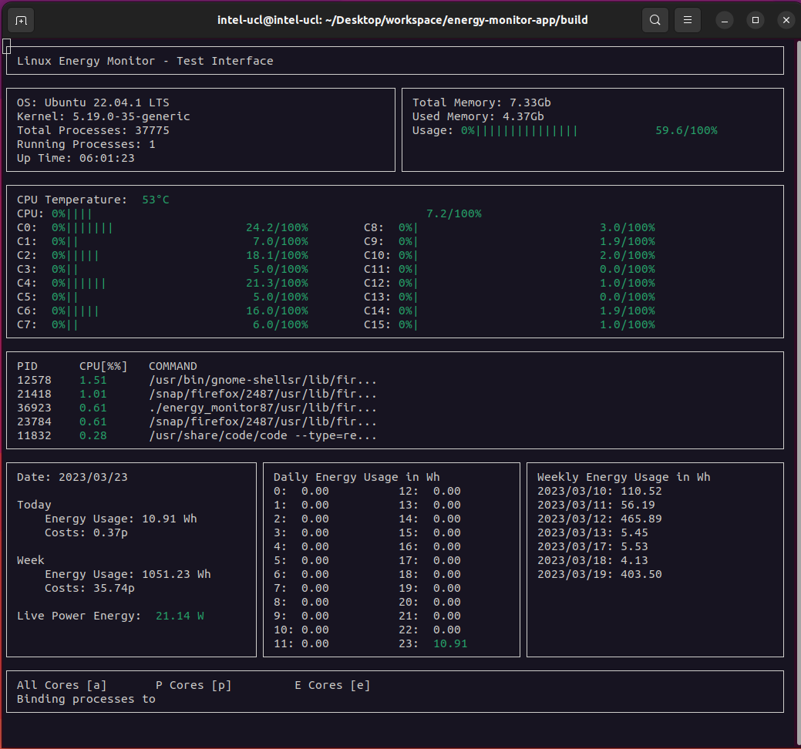

# COMP0016 2022-23 Project: Linux Energy Monitor - TEST branch

## Project Introduction
It is an Industry Exchange Network project in partnership with Intel, aiming to develop a Linux energy monitor application that enables users to view real-time system information and energy consumption while taking advantages of Intel's 12th Gen processor architecture.


## Deployment Manual
### Prerequisites
#### Technologies
- Git
- Linux
- C++ 17 (and onwards)
- CMake
- 12th Gen Intel Processor
#### System Permission
```shell
# Unlock permissions for reading and writing the following files
sudo chmod 777 /sys/class/powercap/intel-rapl/intel-rapl:1/energy_uj
```

### Installation
```shell
git clone -b test https://github.com/huang-wt/energy-monitor-app.git
cd energy-monitor-app
```

### Build and Run
```shell
mkdir build && cd build
cmake ..
make
./energy_monitor
```

## Showcase

